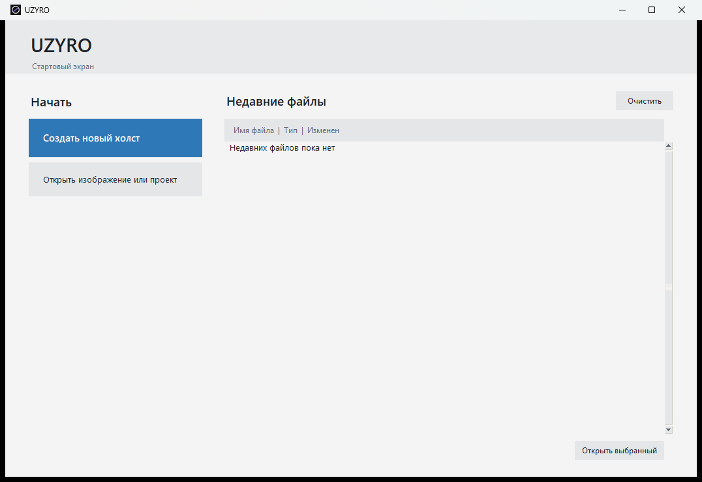
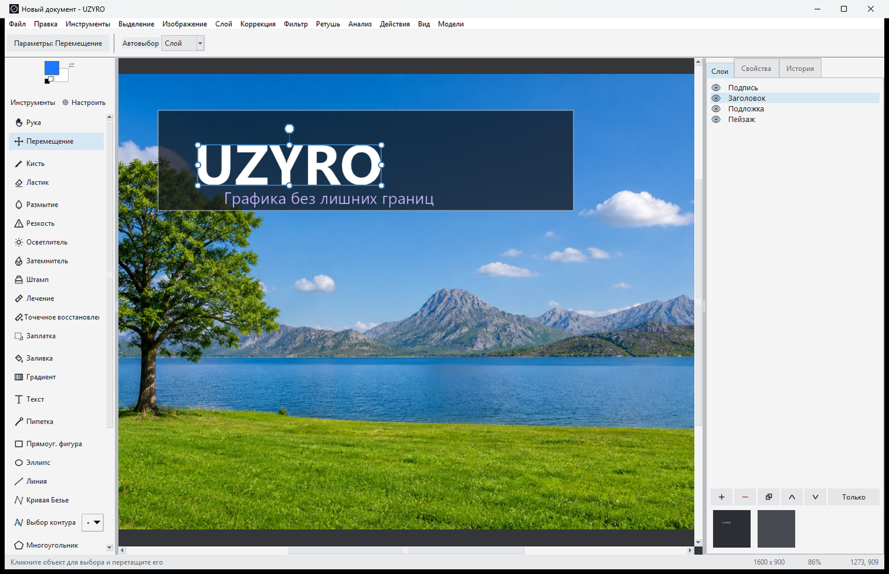
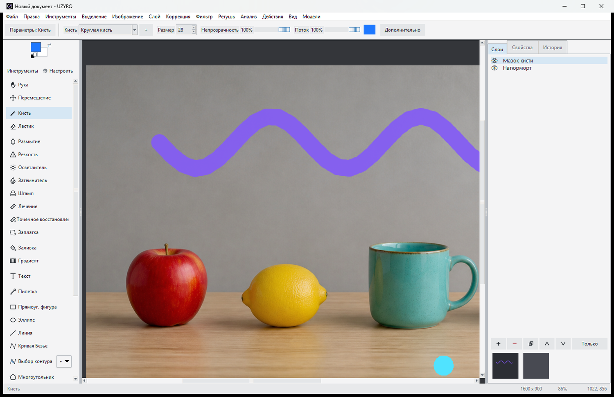

<p align="center">
  
</p>

<p align="center">
  <a href="https://github.com/dumuzeyn/PR/actions/workflows/build-windows.yml"><b>&#1057;&#1082;&#1072;&#1095;&#1072;&#1090;&#1100; UZYRO &#1076;&#1083;&#1103; Windows</b></a>
  &middot;
  <a href="https://github.com/dumuzeyn/PR/archive/refs/heads/master.zip">&#1057;&#1082;&#1072;&#1095;&#1072;&#1090;&#1100; &#1080;&#1089;&#1093;&#1086;&#1076;&#1085;&#1099;&#1081; &#1082;&#1086;&#1076;</a>
  &middot;
  <a href="#english-version">English version</a>
</p>

<h1 align="center">UZYRO</h1>

<p align="center">
  &#1043;&#1088;&#1072;&#1092;&#1080;&#1095;&#1077;&#1089;&#1082;&#1080;&#1081; &#1088;&#1077;&#1076;&#1072;&#1082;&#1090;&#1086;&#1088; &#1076;&#1083;&#1103; Windows &#1089; &#1088;&#1072;&#1089;&#1090;&#1088;&#1086;&#1074;&#1099;&#1084;&#1080;, &#1074;&#1077;&#1082;&#1090;&#1086;&#1088;&#1085;&#1099;&#1084;&#1080; &#1080; &#1090;&#1077;&#1082;&#1089;&#1090;&#1086;&#1074;&#1099;&#1084;&#1080; &#1080;&#1085;&#1089;&#1090;&#1088;&#1091;&#1084;&#1077;&#1085;&#1090;&#1072;&#1084;&#1080;.
</p>

<a id="russian-version"></a>

## &#1054; &#1088;&#1077;&#1076;&#1072;&#1082;&#1090;&#1086;&#1088;&#1077;

UZYRO - &#1085;&#1072;&#1089;&#1090;&#1086;&#1083;&#1100;&#1085;&#1099;&#1081; &#1075;&#1088;&#1072;&#1092;&#1080;&#1095;&#1077;&#1089;&#1082;&#1080;&#1081; &#1088;&#1077;&#1076;&#1072;&#1082;&#1090;&#1086;&#1088; &#1076;&#1083;&#1103; &#1089;&#1086;&#1079;&#1076;&#1072;&#1085;&#1080;&#1103; &#1080; &#1086;&#1073;&#1088;&#1072;&#1073;&#1086;&#1090;&#1082;&#1080; &#1080;&#1079;&#1086;&#1073;&#1088;&#1072;&#1078;&#1077;&#1085;&#1080;&#1081;. &#1055;&#1088;&#1080;&#1083;&#1086;&#1078;&#1077;&#1085;&#1080;&#1077; &#1086;&#1090;&#1082;&#1088;&#1099;&#1074;&#1072;&#1077;&#1090;&#1089;&#1103; &#1086;&#1090;&#1076;&#1077;&#1083;&#1100;&#1085;&#1099;&#1084; &#1089;&#1090;&#1072;&#1088;&#1090;&#1086;&#1074;&#1099;&#1084; &#1101;&#1082;&#1088;&#1072;&#1085;&#1086;&#1084;, &#1075;&#1076;&#1077; &#1084;&#1086;&#1078;&#1085;&#1086; &#1089;&#1086;&#1079;&#1076;&#1072;&#1090;&#1100; &#1093;&#1086;&#1083;&#1089;&#1090;, &#1086;&#1090;&#1082;&#1088;&#1099;&#1090;&#1100; &#1080;&#1079;&#1086;&#1073;&#1088;&#1072;&#1078;&#1077;&#1085;&#1080;&#1077; &#1080;&#1083;&#1080; &#1087;&#1088;&#1086;&#1077;&#1082;&#1090; &#1080; &#1074;&#1077;&#1088;&#1085;&#1091;&#1090;&#1100;&#1089;&#1103; &#1082; &#1085;&#1077;&#1076;&#1072;&#1074;&#1085;&#1077;&#1081; &#1088;&#1072;&#1073;&#1086;&#1090;&#1077;. &#1054;&#1089;&#1085;&#1086;&#1074;&#1085;&#1086;&#1077; &#1086;&#1082;&#1085;&#1086; &#1086;&#1073;&#1098;&#1077;&#1076;&#1080;&#1085;&#1103;&#1077;&#1090; &#1093;&#1086;&#1083;&#1089;&#1090;, &#1080;&#1085;&#1089;&#1090;&#1088;&#1091;&#1084;&#1077;&#1085;&#1090;&#1099;, &#1087;&#1072;&#1088;&#1072;&#1084;&#1077;&#1090;&#1088;&#1099; &#1072;&#1082;&#1090;&#1080;&#1074;&#1085;&#1086;&#1075;&#1086; &#1080;&#1085;&#1089;&#1090;&#1088;&#1091;&#1084;&#1077;&#1085;&#1090;&#1072;, &#1089;&#1083;&#1086;&#1080;, &#1089;&#1074;&#1086;&#1081;&#1089;&#1090;&#1074;&#1072; &#1080; &#1080;&#1089;&#1090;&#1086;&#1088;&#1080;&#1102; &#1076;&#1077;&#1081;&#1089;&#1090;&#1074;&#1080;&#1081;.

&#1056;&#1077;&#1076;&#1072;&#1082;&#1090;&#1086;&#1088; &#1087;&#1086;&#1076;&#1093;&#1086;&#1076;&#1080;&#1090; &#1082;&#1072;&#1082; &#1076;&#1083;&#1103; &#1086;&#1073;&#1099;&#1095;&#1085;&#1086;&#1081; &#1086;&#1073;&#1088;&#1072;&#1073;&#1086;&#1090;&#1082;&#1080; &#1092;&#1086;&#1090;&#1086;&#1075;&#1088;&#1072;&#1092;&#1080;&#1081;, &#1090;&#1072;&#1082; &#1080; &#1076;&#1083;&#1103; &#1084;&#1085;&#1086;&#1075;&#1086;&#1089;&#1083;&#1086;&#1081;&#1085;&#1099;&#1093; &#1087;&#1088;&#1086;&#1077;&#1082;&#1090;&#1086;&#1074; &#1089; &#1088;&#1080;&#1089;&#1086;&#1074;&#1072;&#1085;&#1080;&#1077;&#1084;, &#1088;&#1077;&#1090;&#1091;&#1096;&#1100;&#1102;, &#1074;&#1099;&#1076;&#1077;&#1083;&#1077;&#1085;&#1080;&#1103;&#1084;&#1080;, &#1090;&#1077;&#1082;&#1089;&#1090;&#1086;&#1084;, &#1074;&#1077;&#1082;&#1090;&#1086;&#1088;&#1085;&#1099;&#1084;&#1080; &#1092;&#1080;&#1075;&#1091;&#1088;&#1072;&#1084;&#1080;, &#1084;&#1072;&#1089;&#1082;&#1072;&#1084;&#1080;, &#1082;&#1086;&#1088;&#1088;&#1077;&#1082;&#1090;&#1080;&#1088;&#1091;&#1102;&#1097;&#1080;&#1084;&#1080; &#1089;&#1083;&#1086;&#1103;&#1084;&#1080;, &#1092;&#1080;&#1083;&#1100;&#1090;&#1088;&#1072;&#1084;&#1080; &#1080; &#1090;&#1088;&#1072;&#1085;&#1089;&#1092;&#1086;&#1088;&#1084;&#1072;&#1094;&#1080;&#1103;&#1084;&#1080;.

## &#1053;&#1072;&#1095;&#1072;&#1083;&#1086; &#1088;&#1072;&#1073;&#1086;&#1090;&#1099;

<p align="center">
  
</p>

&#1053;&#1072; &#1089;&#1090;&#1072;&#1088;&#1090;&#1086;&#1074;&#1086;&#1084; &#1101;&#1082;&#1088;&#1072;&#1085;&#1077; &#1076;&#1086;&#1089;&#1090;&#1091;&#1087;&#1085;&#1099; &#1089;&#1086;&#1079;&#1076;&#1072;&#1085;&#1080;&#1077; &#1093;&#1086;&#1083;&#1089;&#1090;&#1072;, &#1086;&#1090;&#1082;&#1088;&#1099;&#1090;&#1080;&#1077; &#1080;&#1079;&#1086;&#1073;&#1088;&#1072;&#1078;&#1077;&#1085;&#1080;&#1103; &#1080;&#1083;&#1080; &#1087;&#1088;&#1086;&#1077;&#1082;&#1090;&#1072;, &#1074;&#1086;&#1089;&#1089;&#1090;&#1072;&#1085;&#1086;&#1074;&#1083;&#1077;&#1085;&#1080;&#1077; &#1089;&#1077;&#1089;&#1089;&#1080;&#1080; &#1080; &#1085;&#1077;&#1076;&#1072;&#1074;&#1085;&#1080;&#1077; &#1092;&#1072;&#1081;&#1083;&#1099;. &#1044;&#1080;&#1072;&#1083;&#1086;&#1075; &#1085;&#1086;&#1074;&#1086;&#1075;&#1086; &#1076;&#1086;&#1082;&#1091;&#1084;&#1077;&#1085;&#1090;&#1072; &#1089;&#1086;&#1076;&#1077;&#1088;&#1078;&#1080;&#1090; &#1075;&#1086;&#1090;&#1086;&#1074;&#1099;&#1077; &#1092;&#1086;&#1088;&#1084;&#1072;&#1090;&#1099; &#1080; &#1087;&#1072;&#1088;&#1072;&#1084;&#1077;&#1090;&#1088;&#1099; &#1096;&#1080;&#1088;&#1080;&#1085;&#1099;, &#1074;&#1099;&#1089;&#1086;&#1090;&#1099;, DPI &#1080; &#1092;&#1086;&#1085;&#1072;. &#1048;&#1079;&#1086;&#1073;&#1088;&#1072;&#1078;&#1077;&#1085;&#1080;&#1077; &#1080;&#1079; &#1073;&#1091;&#1092;&#1077;&#1088;&#1072; &#1086;&#1073;&#1084;&#1077;&#1085;&#1072; &#1084;&#1086;&#1078;&#1077;&#1090; &#1080;&#1089;&#1087;&#1086;&#1083;&#1100;&#1079;&#1086;&#1074;&#1072;&#1090;&#1100;&#1089;&#1103; &#1082;&#1072;&#1082; &#1086;&#1090;&#1076;&#1077;&#1083;&#1100;&#1085;&#1099;&#1081; &#1087;&#1088;&#1077;&#1089;&#1077;&#1090; &#1088;&#1072;&#1079;&#1084;&#1077;&#1088;&#1072;.

&#1040;&#1074;&#1090;&#1086;&#1084;&#1072;&#1090;&#1080;&#1095;&#1077;&#1089;&#1082;&#1072;&#1103; Windows-&#1089;&#1073;&#1086;&#1088;&#1082;&#1072; &#1089;&#1086;&#1079;&#1076;&#1072;&#1077;&#1090;&#1089;&#1103; &#1087;&#1086;&#1089;&#1083;&#1077; &#1082;&#1072;&#1078;&#1076;&#1086;&#1075;&#1086; &#1086;&#1073;&#1085;&#1086;&#1074;&#1083;&#1077;&#1085;&#1080;&#1103; &#1074;&#1077;&#1090;&#1082;&#1080; `master`. &#1053;&#1072; &#1089;&#1090;&#1088;&#1072;&#1085;&#1080;&#1094;&#1077; &#1079;&#1072;&#1075;&#1088;&#1091;&#1079;&#1082;&#1080; &#1086;&#1090;&#1082;&#1088;&#1086;&#1081;&#1090;&#1077; &#1087;&#1086;&#1089;&#1083;&#1077;&#1076;&#1085;&#1080;&#1081; &#1091;&#1089;&#1087;&#1077;&#1096;&#1085;&#1099;&#1081; &#1079;&#1072;&#1087;&#1091;&#1089;&#1082; **Build UZYRO for Windows** &#1080; &#1089;&#1082;&#1072;&#1095;&#1072;&#1081;&#1090;&#1077; &#1072;&#1088;&#1090;&#1077;&#1092;&#1072;&#1082;&#1090; **UZYRO-Windows** &#1089; &#1075;&#1086;&#1090;&#1086;&#1074;&#1099;&#1084; `UZYRO.exe`.

## &#1056;&#1072;&#1073;&#1086;&#1095;&#1077;&#1077; &#1087;&#1088;&#1086;&#1089;&#1090;&#1088;&#1072;&#1085;&#1089;&#1090;&#1074;&#1086;

<p align="center">
  
</p>

&#1042; &#1094;&#1077;&#1085;&#1090;&#1088;&#1077; &#1085;&#1072;&#1093;&#1086;&#1076;&#1080;&#1090;&#1089;&#1103; &#1084;&#1072;&#1089;&#1096;&#1090;&#1072;&#1073;&#1080;&#1088;&#1091;&#1077;&#1084;&#1099;&#1081; &#1093;&#1086;&#1083;&#1089;&#1090;. &#1057;&#1083;&#1077;&#1074;&#1072; &#1088;&#1072;&#1089;&#1087;&#1086;&#1083;&#1086;&#1078;&#1077;&#1085;&#1099; &#1080;&#1085;&#1089;&#1090;&#1088;&#1091;&#1084;&#1077;&#1085;&#1090;&#1099; &#1089; &#1080;&#1084;&#1077;&#1085;&#1072;&#1084;&#1080; &#1080; &#1080;&#1082;&#1086;&#1085;&#1082;&#1072;&#1084;&#1080;, &#1089;&#1074;&#1077;&#1088;&#1093;&#1091; - &#1087;&#1072;&#1088;&#1072;&#1084;&#1077;&#1090;&#1088;&#1099; &#1074;&#1099;&#1073;&#1088;&#1072;&#1085;&#1085;&#1086;&#1075;&#1086; &#1080;&#1085;&#1089;&#1090;&#1088;&#1091;&#1084;&#1077;&#1085;&#1090;&#1072;, &#1089;&#1087;&#1088;&#1072;&#1074;&#1072; - &#1089;&#1083;&#1086;&#1080;, &#1089;&#1074;&#1086;&#1081;&#1089;&#1090;&#1074;&#1072; &#1080; &#1080;&#1089;&#1090;&#1086;&#1088;&#1080;&#1103;. &#1061;&#1086;&#1083;&#1089;&#1090; &#1072;&#1074;&#1090;&#1086;&#1084;&#1072;&#1090;&#1080;&#1095;&#1077;&#1089;&#1082;&#1080; &#1087;&#1086;&#1084;&#1077;&#1097;&#1072;&#1077;&#1090;&#1089;&#1103; &#1074; &#1088;&#1072;&#1073;&#1086;&#1095;&#1091;&#1102; &#1086;&#1073;&#1083;&#1072;&#1089;&#1090;&#1100;, &#1072; &#1084;&#1072;&#1089;&#1096;&#1090;&#1072;&#1073;&#1080;&#1088;&#1086;&#1074;&#1072;&#1085;&#1080;&#1077; &#1089;&#1086;&#1093;&#1088;&#1072;&#1085;&#1103;&#1077;&#1090; &#1090;&#1077;&#1082;&#1091;&#1097;&#1080;&#1081; &#1094;&#1077;&#1085;&#1090;&#1088; &#1080;&#1079;&#1086;&#1073;&#1088;&#1072;&#1078;&#1077;&#1085;&#1080;&#1103;.

&#1048;&#1085;&#1089;&#1090;&#1088;&#1091;&#1084;&#1077;&#1085;&#1090;&#1099; &#1084;&#1086;&#1078;&#1085;&#1086; &#1089;&#1082;&#1088;&#1099;&#1074;&#1072;&#1090;&#1100;, &#1074;&#1086;&#1079;&#1074;&#1088;&#1072;&#1097;&#1072;&#1090;&#1100; &#1080; &#1087;&#1077;&#1088;&#1077;&#1089;&#1090;&#1072;&#1074;&#1083;&#1103;&#1090;&#1100; &#1087;&#1077;&#1088;&#1077;&#1090;&#1072;&#1089;&#1082;&#1080;&#1074;&#1072;&#1085;&#1080;&#1077;&#1084;. &#1055;&#1088;&#1080; &#1085;&#1072;&#1074;&#1077;&#1076;&#1077;&#1085;&#1080;&#1080; &#1087;&#1086;&#1103;&#1074;&#1083;&#1103;&#1077;&#1090;&#1089;&#1103; &#1086;&#1087;&#1080;&#1089;&#1072;&#1085;&#1080;&#1077; &#1080; 18-&#1082;&#1072;&#1076;&#1088;&#1086;&#1074;&#1072;&#1103; &#1076;&#1077;&#1084;&#1086;&#1085;&#1089;&#1090;&#1088;&#1072;&#1094;&#1080;&#1103;, &#1089;&#1086;&#1079;&#1076;&#1072;&#1085;&#1085;&#1072;&#1103; &#1090;&#1077;&#1084; &#1078;&#1077; &#1076;&#1074;&#1080;&#1078;&#1082;&#1086;&#1084; UZYRO, &#1082;&#1086;&#1090;&#1086;&#1088;&#1099;&#1081; &#1074;&#1099;&#1087;&#1086;&#1083;&#1085;&#1103;&#1077;&#1090; &#1088;&#1077;&#1072;&#1083;&#1100;&#1085;&#1086;&#1077; &#1076;&#1077;&#1081;&#1089;&#1090;&#1074;&#1080;&#1077;.

## &#1056;&#1080;&#1089;&#1086;&#1074;&#1072;&#1085;&#1080;&#1077; &#1080; &#1088;&#1077;&#1090;&#1091;&#1096;&#1100;

<p align="center">
  
</p>

&#1050;&#1080;&#1089;&#1090;&#1080; &#1087;&#1086;&#1076;&#1076;&#1077;&#1088;&#1078;&#1080;&#1074;&#1072;&#1102;&#1090; &#1088;&#1072;&#1079;&#1084;&#1077;&#1088;, &#1078;&#1077;&#1089;&#1090;&#1082;&#1086;&#1089;&#1090;&#1100;, &#1085;&#1077;&#1087;&#1088;&#1086;&#1079;&#1088;&#1072;&#1095;&#1085;&#1086;&#1089;&#1090;&#1100;, &#1087;&#1086;&#1090;&#1086;&#1082;, &#1089;&#1075;&#1083;&#1072;&#1078;&#1080;&#1074;&#1072;&#1085;&#1080;&#1077;, &#1080;&#1085;&#1090;&#1077;&#1088;&#1074;&#1072;&#1083;, &#1076;&#1080;&#1085;&#1072;&#1084;&#1080;&#1082;&#1091; &#1087;&#1077;&#1088;&#1072;, &#1089;&#1086;&#1073;&#1089;&#1090;&#1074;&#1077;&#1085;&#1085;&#1099;&#1077; &#1085;&#1072;&#1082;&#1086;&#1085;&#1077;&#1095;&#1085;&#1080;&#1082;&#1080; &#1080; &#1087;&#1086;&#1083;&#1100;&#1079;&#1086;&#1074;&#1072;&#1090;&#1077;&#1083;&#1100;&#1089;&#1082;&#1080;&#1077; &#1087;&#1088;&#1077;&#1089;&#1077;&#1090;&#1099;. &#1048;&#1079;&#1084;&#1077;&#1085;&#1077;&#1085;&#1080;&#1103; &#1079;&#1072;&#1087;&#1080;&#1089;&#1099;&#1074;&#1072;&#1102;&#1090;&#1089;&#1103; &#1082;&#1086;&#1084;&#1087;&#1072;&#1082;&#1090;&#1085;&#1099;&#1084;&#1080; &#1091;&#1095;&#1072;&#1089;&#1090;&#1082;&#1072;&#1084;&#1080;, &#1087;&#1086;&#1101;&#1090;&#1086;&#1084;&#1091; &#1076;&#1083;&#1080;&#1085;&#1085;&#1099;&#1081; &#1084;&#1072;&#1079;&#1086;&#1082; &#1085;&#1077; &#1090;&#1088;&#1077;&#1073;&#1091;&#1077;&#1090; &#1089;&#1086;&#1093;&#1088;&#1072;&#1085;&#1077;&#1085;&#1080;&#1103; &#1087;&#1086;&#1083;&#1085;&#1086;&#1081; &#1082;&#1086;&#1087;&#1080;&#1080; &#1076;&#1086;&#1082;&#1091;&#1084;&#1077;&#1085;&#1090;&#1072;.

&#1044;&#1083;&#1103; &#1086;&#1073;&#1088;&#1072;&#1073;&#1086;&#1090;&#1082;&#1080; &#1080;&#1079;&#1086;&#1073;&#1088;&#1072;&#1078;&#1077;&#1085;&#1080;&#1103; &#1087;&#1088;&#1077;&#1076;&#1091;&#1089;&#1084;&#1086;&#1090;&#1088;&#1077;&#1085;&#1099; &#1083;&#1072;&#1089;&#1090;&#1080;&#1082;, &#1088;&#1072;&#1079;&#1084;&#1099;&#1090;&#1080;&#1077;, &#1088;&#1077;&#1079;&#1082;&#1086;&#1089;&#1090;&#1100;, &#1086;&#1089;&#1074;&#1077;&#1090;&#1083;&#1077;&#1085;&#1080;&#1077;, &#1079;&#1072;&#1090;&#1077;&#1084;&#1085;&#1077;&#1085;&#1080;&#1077;, &#1096;&#1090;&#1072;&#1084;&#1087;, &#1083;&#1077;&#1095;&#1077;&#1085;&#1080;&#1077;, &#1090;&#1086;&#1095;&#1077;&#1095;&#1085;&#1086;&#1077; &#1074;&#1086;&#1089;&#1089;&#1090;&#1072;&#1085;&#1086;&#1074;&#1083;&#1077;&#1085;&#1080;&#1077;, &#1079;&#1072;&#1087;&#1083;&#1072;&#1090;&#1082;&#1072;, &#1079;&#1072;&#1083;&#1080;&#1074;&#1082;&#1072; &#1080; &#1075;&#1088;&#1072;&#1076;&#1080;&#1077;&#1085;&#1090;. &#1041;&#1086;&#1083;&#1100;&#1096;&#1080;&#1085;&#1089;&#1090;&#1074;&#1086; &#1086;&#1087;&#1077;&#1088;&#1072;&#1094;&#1080;&#1081; &#1091;&#1095;&#1080;&#1090;&#1099;&#1074;&#1072;&#1077;&#1090; &#1072;&#1082;&#1090;&#1080;&#1074;&#1085;&#1086;&#1077; &#1074;&#1099;&#1076;&#1077;&#1083;&#1077;&#1085;&#1080;&#1077; &#1080; &#1084;&#1072;&#1089;&#1082;&#1091; &#1089;&#1083;&#1086;&#1103;.

## &#1054;&#1089;&#1085;&#1086;&#1074;&#1085;&#1099;&#1077; &#1074;&#1086;&#1079;&#1084;&#1086;&#1078;&#1085;&#1086;&#1089;&#1090;&#1080;

- &#1057;&#1083;&#1086;&#1080;, &#1075;&#1088;&#1091;&#1087;&#1087;&#1099;, &#1085;&#1077;&#1087;&#1088;&#1086;&#1079;&#1088;&#1072;&#1095;&#1085;&#1086;&#1089;&#1090;&#1100;, &#1088;&#1077;&#1078;&#1080;&#1084;&#1099; &#1085;&#1072;&#1083;&#1086;&#1078;&#1077;&#1085;&#1080;&#1103;, &#1073;&#1083;&#1086;&#1082;&#1080;&#1088;&#1086;&#1074;&#1082;&#1080; &#1080; &#1086;&#1073;&#1090;&#1088;&#1072;&#1074;&#1086;&#1095;&#1085;&#1099;&#1077; &#1084;&#1072;&#1089;&#1082;&#1080;.
- &#1056;&#1072;&#1089;&#1090;&#1088;&#1086;&#1074;&#1099;&#1077; &#1084;&#1072;&#1089;&#1082;&#1080; &#1089;&#1083;&#1086;&#1077;&#1074; &#1089; &#1087;&#1083;&#1086;&#1090;&#1085;&#1086;&#1089;&#1090;&#1100;&#1102;, &#1088;&#1072;&#1089;&#1090;&#1091;&#1096;&#1077;&#1074;&#1082;&#1086;&#1081; &#1080; &#1085;&#1077;&#1089;&#1082;&#1086;&#1083;&#1100;&#1082;&#1080;&#1084;&#1080; &#1088;&#1077;&#1078;&#1080;&#1084;&#1072;&#1084;&#1080; &#1087;&#1088;&#1086;&#1089;&#1084;&#1086;&#1090;&#1088;&#1072;.
- &#1055;&#1088;&#1103;&#1084;&#1086;&#1091;&#1075;&#1086;&#1083;&#1100;&#1085;&#1099;&#1077;, &#1101;&#1083;&#1083;&#1080;&#1087;&#1090;&#1080;&#1095;&#1077;&#1089;&#1082;&#1080;&#1077;, &#1089;&#1074;&#1086;&#1073;&#1086;&#1076;&#1085;&#1099;&#1077;, &#1084;&#1072;&#1075;&#1085;&#1080;&#1090;&#1085;&#1099;&#1077; &#1080; &#1087;&#1086;&#1083;&#1080;&#1075;&#1086;&#1085;&#1072;&#1083;&#1100;&#1085;&#1099;&#1077; &#1074;&#1099;&#1076;&#1077;&#1083;&#1077;&#1085;&#1080;&#1103;.
- &#1041;&#1099;&#1089;&#1090;&#1088;&#1086;&#1077; &#1074;&#1099;&#1076;&#1077;&#1083;&#1077;&#1085;&#1080;&#1077;, &#1074;&#1086;&#1083;&#1096;&#1077;&#1073;&#1085;&#1072;&#1103; &#1087;&#1072;&#1083;&#1086;&#1095;&#1082;&#1072;, &#1094;&#1074;&#1077;&#1090;&#1086;&#1074;&#1086;&#1081; &#1076;&#1080;&#1072;&#1087;&#1072;&#1079;&#1086;&#1085; &#1080; &#1088;&#1072;&#1073;&#1086;&#1095;&#1072;&#1103; &#1086;&#1073;&#1083;&#1072;&#1089;&#1090;&#1100; &#1074;&#1099;&#1076;&#1077;&#1083;&#1077;&#1085;&#1080;&#1103; &#1080; &#1084;&#1072;&#1089;&#1082;&#1080;.
- &#1042;&#1077;&#1082;&#1090;&#1086;&#1088;&#1085;&#1099;&#1077; &#1087;&#1088;&#1103;&#1084;&#1086;&#1091;&#1075;&#1086;&#1083;&#1100;&#1085;&#1080;&#1082;&#1080;, &#1101;&#1083;&#1083;&#1080;&#1087;&#1089;&#1099;, &#1083;&#1080;&#1085;&#1080;&#1080;, &#1084;&#1085;&#1086;&#1075;&#1086;&#1091;&#1075;&#1086;&#1083;&#1100;&#1085;&#1080;&#1082;&#1080;, &#1079;&#1074;&#1077;&#1079;&#1076;&#1099;, &#1087;&#1086;&#1083;&#1100;&#1079;&#1086;&#1074;&#1072;&#1090;&#1077;&#1083;&#1100;&#1089;&#1082;&#1080;&#1077; &#1092;&#1080;&#1075;&#1091;&#1088;&#1099; &#1080; &#1082;&#1088;&#1080;&#1074;&#1099;&#1077; &#1041;&#1077;&#1079;&#1100;&#1077;.
- &#1056;&#1077;&#1076;&#1072;&#1082;&#1090;&#1080;&#1088;&#1091;&#1077;&#1084;&#1099;&#1077; &#1090;&#1077;&#1082;&#1089;&#1090;&#1086;&#1074;&#1099;&#1077; &#1089;&#1083;&#1086;&#1080;, &#1072;&#1073;&#1079;&#1072;&#1094;&#1099;, &#1080;&#1085;&#1090;&#1077;&#1088;&#1074;&#1072;&#1083;&#1099;, &#1074;&#1099;&#1088;&#1072;&#1074;&#1085;&#1080;&#1074;&#1072;&#1085;&#1080;&#1077;, &#1090;&#1088;&#1072;&#1085;&#1089;&#1092;&#1086;&#1088;&#1084;&#1072;&#1094;&#1080;&#1103; &#1080; &#1090;&#1077;&#1082;&#1089;&#1090; &#1087;&#1086; &#1082;&#1086;&#1085;&#1090;&#1091;&#1088;&#1091;.
- &#1057;&#1074;&#1086;&#1073;&#1086;&#1076;&#1085;&#1072;&#1103; &#1090;&#1088;&#1072;&#1085;&#1089;&#1092;&#1086;&#1088;&#1084;&#1072;&#1094;&#1080;&#1103;, &#1087;&#1086;&#1074;&#1086;&#1088;&#1086;&#1090;, &#1080;&#1079;&#1084;&#1077;&#1085;&#1077;&#1085;&#1080;&#1077; &#1088;&#1072;&#1079;&#1084;&#1077;&#1088;&#1072;, &#1087;&#1077;&#1088;&#1089;&#1087;&#1077;&#1082;&#1090;&#1080;&#1074;&#1072; &#1080; &#1076;&#1077;&#1092;&#1086;&#1088;&#1084;&#1072;&#1094;&#1080;&#1103; &#1087;&#1086; &#1089;&#1077;&#1090;&#1082;&#1077;.
- &#1050;&#1086;&#1088;&#1088;&#1077;&#1082;&#1090;&#1080;&#1088;&#1091;&#1102;&#1097;&#1080;&#1077; &#1089;&#1083;&#1086;&#1080;, &#1092;&#1080;&#1083;&#1100;&#1090;&#1088;&#1099;, &#1089;&#1090;&#1080;&#1083;&#1080; &#1089;&#1083;&#1086;&#1077;&#1074;, &#1091;&#1087;&#1088;&#1072;&#1074;&#1083;&#1077;&#1085;&#1080;&#1077; &#1094;&#1074;&#1077;&#1090;&#1086;&#1084; &#1080; &#1087;&#1086;&#1076;&#1075;&#1086;&#1090;&#1086;&#1074;&#1082;&#1072; &#1082; &#1087;&#1077;&#1095;&#1072;&#1090;&#1080;.
- &#1047;&#1072;&#1087;&#1080;&#1089;&#1100; &#1076;&#1077;&#1081;&#1089;&#1090;&#1074;&#1080;&#1081;, &#1087;&#1072;&#1082;&#1077;&#1090;&#1085;&#1072;&#1103; &#1086;&#1073;&#1088;&#1072;&#1073;&#1086;&#1090;&#1082;&#1072; &#1080; &#1088;&#1072;&#1089;&#1096;&#1080;&#1088;&#1103;&#1077;&#1084;&#1072;&#1103; &#1089;&#1080;&#1089;&#1090;&#1077;&#1084;&#1072; &#1087;&#1083;&#1072;&#1075;&#1080;&#1085;&#1086;&#1074;.
- &#1051;&#1086;&#1082;&#1072;&#1083;&#1100;&#1085;&#1099;&#1077; &#1075;&#1077;&#1085;&#1077;&#1088;&#1072;&#1090;&#1080;&#1074;&#1085;&#1099;&#1077; &#1084;&#1086;&#1076;&#1077;&#1083;&#1080;, &#1091;&#1089;&#1090;&#1072;&#1085;&#1072;&#1074;&#1083;&#1080;&#1074;&#1072;&#1077;&#1084;&#1099;&#1077; &#1086;&#1090;&#1076;&#1077;&#1083;&#1100;&#1085;&#1086; &#1080; &#1085;&#1077; &#1074;&#1093;&#1086;&#1076;&#1103;&#1097;&#1080;&#1077; &#1074; &#1088;&#1072;&#1079;&#1084;&#1077;&#1088; EXE.
- &#1054;&#1073;&#1097;&#1072;&#1103; &#1086;&#1090;&#1084;&#1077;&#1085;&#1072; &#1080; &#1087;&#1086;&#1074;&#1090;&#1086;&#1088; &#1076;&#1083;&#1103; &#1084;&#1072;&#1079;&#1082;&#1086;&#1074;, &#1087;&#1077;&#1088;&#1077;&#1084;&#1077;&#1097;&#1077;&#1085;&#1080;&#1081;, &#1089;&#1083;&#1086;&#1077;&#1074;, &#1074;&#1099;&#1076;&#1077;&#1083;&#1077;&#1085;&#1080;&#1081; &#1080; &#1080;&#1079;&#1084;&#1077;&#1085;&#1077;&#1085;&#1080;&#1081; &#1076;&#1086;&#1082;&#1091;&#1084;&#1077;&#1085;&#1090;&#1072;.

## &#1060;&#1086;&#1088;&#1084;&#1072;&#1090;&#1099;

UZYRO &#1080;&#1089;&#1087;&#1086;&#1083;&#1100;&#1079;&#1091;&#1077;&#1090; &#1087;&#1088;&#1086;&#1077;&#1082;&#1090;&#1085;&#1099;&#1081; &#1092;&#1086;&#1088;&#1084;&#1072;&#1090; `.prdx`, &#1089;&#1086;&#1093;&#1088;&#1072;&#1085;&#1103;&#1102;&#1097;&#1080;&#1081; &#1089;&#1083;&#1086;&#1080;, &#1084;&#1072;&#1089;&#1082;&#1080;, &#1074;&#1077;&#1082;&#1090;&#1086;&#1088;&#1085;&#1099;&#1077; &#1076;&#1072;&#1085;&#1085;&#1099;&#1077; &#1080; &#1089;&#1090;&#1088;&#1091;&#1082;&#1090;&#1091;&#1088;&#1091; &#1076;&#1086;&#1082;&#1091;&#1084;&#1077;&#1085;&#1090;&#1072;. &#1055;&#1086;&#1076;&#1076;&#1077;&#1088;&#1078;&#1080;&#1074;&#1072;&#1077;&#1090;&#1089;&#1103; &#1080;&#1084;&#1087;&#1086;&#1088;&#1090; &#1080; &#1101;&#1082;&#1089;&#1087;&#1086;&#1088;&#1090; PNG, JPEG, WebP, BMP &#1080; TIFF, &#1072; &#1090;&#1072;&#1082;&#1078;&#1077; &#1088;&#1072;&#1073;&#1086;&#1090;&#1072; &#1089; PSD/PSB &#1074; &#1087;&#1088;&#1077;&#1076;&#1077;&#1083;&#1072;&#1093; &#1074;&#1086;&#1079;&#1084;&#1086;&#1078;&#1085;&#1086;&#1089;&#1090;&#1077;&#1081; &#1086;&#1090;&#1082;&#1088;&#1099;&#1090;&#1086;&#1075;&#1086; &#1092;&#1086;&#1088;&#1084;&#1072;&#1090;&#1072; &#1080; &#1080;&#1089;&#1087;&#1086;&#1083;&#1100;&#1079;&#1091;&#1077;&#1084;&#1099;&#1093; &#1073;&#1080;&#1073;&#1083;&#1080;&#1086;&#1090;&#1077;&#1082;.

&#1057;&#1083;&#1086;&#1078;&#1085;&#1099;&#1077; &#1089;&#1090;&#1088;&#1091;&#1082;&#1090;&#1091;&#1088;&#1099; Photoshop, &#1082;&#1086;&#1090;&#1086;&#1088;&#1099;&#1077; &#1085;&#1077;&#1083;&#1100;&#1079;&#1103; &#1089;&#1086;&#1093;&#1088;&#1072;&#1085;&#1080;&#1090;&#1100; &#1088;&#1077;&#1076;&#1072;&#1082;&#1090;&#1080;&#1088;&#1091;&#1077;&#1084;&#1099;&#1084;&#1080; &#1073;&#1077;&#1079; &#1087;&#1086;&#1090;&#1077;&#1088;&#1100;, &#1087;&#1088;&#1077;&#1086;&#1073;&#1088;&#1072;&#1079;&#1091;&#1102;&#1090;&#1089;&#1103; &#1074; &#1087;&#1080;&#1082;&#1089;&#1077;&#1083;&#1100;&#1085;&#1099;&#1077; &#1089;&#1083;&#1086;&#1080; &#1080; &#1087;&#1077;&#1088;&#1077;&#1095;&#1080;&#1089;&#1083;&#1103;&#1102;&#1090;&#1089;&#1103; &#1074; &#1086;&#1090;&#1095;&#1077;&#1090;&#1077; &#1101;&#1082;&#1089;&#1087;&#1086;&#1088;&#1090;&#1072;.

## &#1055;&#1088;&#1086;&#1080;&#1079;&#1074;&#1086;&#1076;&#1080;&#1090;&#1077;&#1083;&#1100;&#1085;&#1086;&#1089;&#1090;&#1100; &#1080; &#1085;&#1072;&#1076;&#1077;&#1078;&#1085;&#1086;&#1089;&#1090;&#1100;

&#1061;&#1086;&#1083;&#1089;&#1090; &#1086;&#1090;&#1088;&#1080;&#1089;&#1086;&#1074;&#1099;&#1074;&#1072;&#1077;&#1090;&#1089;&#1103; &#1087;&#1083;&#1080;&#1090;&#1082;&#1072;&#1084;&#1080;, &#1072; &#1082;&#1080;&#1089;&#1090;&#1080;, &#1088;&#1077;&#1090;&#1091;&#1096;&#1100; &#1080; &#1080;&#1089;&#1090;&#1086;&#1088;&#1080;&#1103; &#1089;&#1086;&#1093;&#1088;&#1072;&#1085;&#1103;&#1102;&#1090; &#1090;&#1086;&#1083;&#1100;&#1082;&#1086; &#1080;&#1079;&#1084;&#1077;&#1085;&#1077;&#1085;&#1085;&#1099;&#1077; &#1086;&#1073;&#1083;&#1072;&#1089;&#1090;&#1080;. &#1060;&#1080;&#1083;&#1100;&#1090;&#1088;&#1099; &#1080; &#1087;&#1088;&#1077;&#1074;&#1100;&#1102; &#1080;&#1089;&#1087;&#1086;&#1083;&#1100;&#1079;&#1091;&#1102;&#1090; &#1082;&#1101;&#1096;, &#1090;&#1103;&#1078;&#1077;&#1083;&#1099;&#1077; &#1086;&#1087;&#1077;&#1088;&#1072;&#1094;&#1080;&#1080; &#1084;&#1086;&#1075;&#1091;&#1090; &#1074;&#1099;&#1087;&#1086;&#1083;&#1085;&#1103;&#1090;&#1100;&#1089;&#1103; &#1074; &#1092;&#1086;&#1085;&#1077;, &#1072; &#1091;&#1089;&#1090;&#1072;&#1088;&#1077;&#1074;&#1096;&#1080;&#1081; &#1088;&#1077;&#1079;&#1091;&#1083;&#1100;&#1090;&#1072;&#1090; &#1085;&#1077; &#1087;&#1088;&#1080;&#1084;&#1077;&#1085;&#1103;&#1077;&#1090;&#1089;&#1103; &#1087;&#1086;&#1074;&#1077;&#1088;&#1093; &#1073;&#1086;&#1083;&#1077;&#1077; &#1085;&#1086;&#1074;&#1086;&#1075;&#1086; &#1080;&#1079;&#1084;&#1077;&#1085;&#1077;&#1085;&#1080;&#1103;.

&#1055;&#1088;&#1086;&#1077;&#1082;&#1090;&#1099; `.prdx` &#1089;&#1086;&#1093;&#1088;&#1072;&#1085;&#1103;&#1102;&#1090;&#1089;&#1103; &#1072;&#1090;&#1086;&#1084;&#1072;&#1088;&#1085;&#1086; &#1080; &#1089;&#1086;&#1076;&#1077;&#1088;&#1078;&#1072;&#1090; &#1082;&#1086;&#1085;&#1090;&#1088;&#1086;&#1083;&#1100;&#1085;&#1099;&#1077; &#1089;&#1091;&#1084;&#1084;&#1099; &#1087;&#1083;&#1080;&#1090;&#1086;&#1082;. &#1042; &#1087;&#1088;&#1080;&#1083;&#1086;&#1078;&#1077;&#1085;&#1080;&#1077; &#1074;&#1089;&#1090;&#1088;&#1086;&#1077;&#1085;&#1086; &#1074;&#1086;&#1089;&#1089;&#1090;&#1072;&#1085;&#1086;&#1074;&#1083;&#1077;&#1085;&#1080;&#1077; &#1087;&#1086;&#1089;&#1083;&#1077;&#1076;&#1085;&#1077;&#1081; &#1089;&#1077;&#1089;&#1089;&#1080;&#1080;. &#1055;&#1086;&#1076;&#1088;&#1086;&#1073;&#1085;&#1086;&#1089;&#1090;&#1080; &#1072;&#1088;&#1093;&#1080;&#1090;&#1077;&#1082;&#1090;&#1091;&#1088;&#1099; &#1080; &#1090;&#1077;&#1082;&#1091;&#1097;&#1080;&#1077; &#1086;&#1075;&#1088;&#1072;&#1085;&#1080;&#1095;&#1077;&#1085;&#1080;&#1103; &#1085;&#1072;&#1093;&#1086;&#1076;&#1103;&#1090;&#1089;&#1103; &#1074; [ARCHITECTURE.md](ARCHITECTURE.md), [PERFORMANCE.md](PERFORMANCE.md) &#1080; [ROADMAP.md](ROADMAP.md).

## &#1047;&#1072;&#1087;&#1091;&#1089;&#1082; &#1080;&#1079; &#1080;&#1089;&#1093;&#1086;&#1076;&#1085;&#1086;&#1075;&#1086; &#1082;&#1086;&#1076;&#1072;

```powershell
.\run.ps1
```

&#1057;&#1073;&#1086;&#1088;&#1082;&#1072; EXE:

```powershell
.\build_exe.ps1
```

&#1047;&#1072;&#1087;&#1091;&#1089;&#1082; &#1090;&#1077;&#1089;&#1090;&#1086;&#1074;:

```powershell
.\run_tests.ps1
```

UZYRO &#1085;&#1077; &#1080;&#1089;&#1087;&#1086;&#1083;&#1100;&#1079;&#1091;&#1077;&#1090; &#1073;&#1080;&#1073;&#1083;&#1080;&#1086;&#1090;&#1077;&#1082;&#1080;-&#1079;&#1072;&#1075;&#1083;&#1091;&#1096;&#1082;&#1080; &#1080;&#1083;&#1080; &#1074;&#1099;&#1084;&#1099;&#1096;&#1083;&#1077;&#1085;&#1085;&#1099;&#1077; AI-&#1087;&#1072;&#1082;&#1077;&#1090;&#1099;. &#1054;&#1089;&#1085;&#1086;&#1074;&#1085;&#1099;&#1077; &#1079;&#1072;&#1074;&#1080;&#1089;&#1080;&#1084;&#1086;&#1089;&#1090;&#1080; &#1091;&#1089;&#1090;&#1072;&#1085;&#1072;&#1074;&#1083;&#1080;&#1074;&#1072;&#1102;&#1090;&#1089;&#1103; &#1080;&#1079; &#1085;&#1072;&#1089;&#1090;&#1086;&#1103;&#1097;&#1080;&#1093; &#1087;&#1088;&#1086;&#1077;&#1082;&#1090;&#1086;&#1074;: NumPy, OpenCV, Pillow, rawpy &#1080; psd-tools.

&#1042;&#1089;&#1077; &#1089;&#1082;&#1088;&#1080;&#1085;&#1096;&#1086;&#1090;&#1099; &#1074;&#1099;&#1096;&#1077; &#1089;&#1085;&#1103;&#1090;&#1099; &#1090;&#1086;&#1083;&#1100;&#1082;&#1086; &#1080;&#1079; &#1086;&#1082;&#1085;&#1072; UZYRO &#1074; &#1080;&#1079;&#1086;&#1083;&#1080;&#1088;&#1086;&#1074;&#1072;&#1085;&#1085;&#1086;&#1081; &#1076;&#1077;&#1084;&#1086;&#1085;&#1089;&#1090;&#1088;&#1072;&#1094;&#1080;&#1086;&#1085;&#1085;&#1086;&#1081; &#1089;&#1077;&#1089;&#1089;&#1080;&#1080;. &#1054;&#1085;&#1080; &#1085;&#1077; &#1089;&#1086;&#1076;&#1077;&#1088;&#1078;&#1072;&#1090; &#1088;&#1072;&#1073;&#1086;&#1095;&#1080;&#1081; &#1089;&#1090;&#1086;&#1083;, &#1087;&#1072;&#1085;&#1077;&#1083;&#1100; &#1079;&#1072;&#1076;&#1072;&#1095;, &#1083;&#1080;&#1095;&#1085;&#1099;&#1077; &#1092;&#1072;&#1081;&#1083;&#1099;, &#1080;&#1089;&#1090;&#1086;&#1088;&#1080;&#1102; &#1087;&#1088;&#1086;&#1077;&#1082;&#1090;&#1086;&#1074; &#1080;&#1083;&#1080; &#1076;&#1088;&#1091;&#1075;&#1080;&#1077; &#1076;&#1072;&#1085;&#1085;&#1099;&#1077; &#1082;&#1086;&#1084;&#1087;&#1100;&#1102;&#1090;&#1077;&#1088;&#1072; &#1072;&#1074;&#1090;&#1086;&#1088;&#1072;.

---

<a id="english-version"></a>

# English Version

<p align="center">
  <a href="https://github.com/dumuzeyn/PR/actions/workflows/build-windows.yml"><b>Download UZYRO for Windows</b></a>
  &middot;
  <a href="https://github.com/dumuzeyn/PR/archive/refs/heads/master.zip">Download source code</a>
  &middot;
  <a href="#russian-version">&#1056;&#1091;&#1089;&#1089;&#1082;&#1072;&#1103; &#1074;&#1077;&#1088;&#1089;&#1080;&#1103;</a>
</p>

## About UZYRO

UZYRO is a desktop graphics editor for creating and processing images. It starts with a dedicated workspace for creating a canvas, opening an image or project, restoring a session, and returning to recent work. The main editor combines the canvas, named tools, contextual options, layers, properties, and command history.

The application supports everyday image editing as well as layered projects involving painting, retouching, selections, text, vector shapes, masks, adjustment layers, filters, transforms, and batch processing.

## Getting Started

<p align="center">
  
</p>

The start screen provides new-canvas creation, image and project opening, session recovery, and recent files. The new-document dialog includes presets and controls for width, height, DPI, and background. A clipboard image can be offered as a size preset when available.

An automatic Windows build is produced after every update to `master`. Open the latest successful **Build UZYRO for Windows** run and download the **UZYRO-Windows** artifact containing `UZYRO.exe`.

## Workspace

<p align="center">
  
</p>

The scalable canvas occupies the center. Named tools are placed on the left, contextual options are shown at the top, and layers, properties, and history are available on the right. The document is fitted into the workspace, while zooming preserves the current viewport center.

Tools can be hidden, restored, and reordered by dragging. Hovering a tool displays its description and an 18-frame demonstration generated by the same UZYRO engine that performs the real edit.

## Painting and Retouching

<p align="center">
  
</p>

Brushes support size, hardness, opacity, flow, smoothing, spacing, pen dynamics, custom tips, and user presets. Stroke history stores compact changed regions instead of copying the complete document for every action.

Image tools include eraser, blur, sharpen, dodge, burn, clone stamp, healing, spot healing, patch, fill, and gradient. Most operations respect the current selection and layer mask.

## Main Features

- Layers, groups, opacity, blend modes, locks, and clipping masks.
- Raster layer masks with density, feathering, and multiple preview modes.
- Rectangular, elliptical, freehand, magnetic, and polygonal selections.
- Quick Selection, Magic Wand, Color Range, and a Select and Mask workspace.
- Vector rectangles, ellipses, lines, polygons, stars, custom shapes, and Bezier paths.
- Editable text layers with paragraph controls, spacing, transforms, and text on a path.
- Free Transform with rotation, resize, perspective, and editable warp grids.
- Adjustment layers, filters, layer styles, color management, and print preparation.
- Action recording, persistent batch queues, and an extensible plugin system.
- Optional local generative models downloaded separately from the EXE.
- Unified undo and redo for strokes, movement, layers, selections, and document edits.

## File Formats

UZYRO uses the `.prdx` project format to preserve layers, masks, vector information, and document structure. It imports and exports PNG, JPEG, WebP, BMP, and TIFF, and supports PSD/PSB within the capabilities of the open format and the libraries used by the project.

Photoshop-specific structures that cannot be written back as editable data are rasterized and listed in the export report instead of being silently advertised as lossless.

## Performance and Reliability

The canvas is rendered in tiles, while painting, retouching, and history store only changed regions. Filters and previews use caches, expensive work can run in the background, and stale background results are discarded after a newer edit.

`.prdx` projects are saved atomically and include per-tile integrity hashes. Session recovery is built into the application. Architecture details and current limitations are documented in [ARCHITECTURE.md](ARCHITECTURE.md), [PERFORMANCE.md](PERFORMANCE.md), and [ROADMAP.md](ROADMAP.md).

## Run from Source

```powershell
.\run.ps1
```

Build the EXE:

```powershell
.\build_exe.ps1
```

Run the test suite:

```powershell
.\run_tests.ps1
```

UZYRO does not use placeholder libraries or fabricated AI packages. Its core dependencies are established upstream projects including NumPy, OpenCV, Pillow, rawpy, and psd-tools.

All screenshots in this README were captured from the UZYRO window in an isolated demonstration session. They contain no desktop, taskbar, personal files, project history, or other data from the author's computer.

---

## &#1040;&#1074;&#1090;&#1086;&#1088; / Author

**UZYRO &#1089;&#1086;&#1079;&#1076;&#1072;&#1085; &#1080; &#1088;&#1072;&#1079;&#1088;&#1072;&#1073;&#1072;&#1090;&#1099;&#1074;&#1072;&#1077;&#1090;&#1089;&#1103; [dumuzeyn](https://github.com/dumuzeyn).**<br>
&#1048;&#1076;&#1077;&#1103; &#1087;&#1088;&#1086;&#1077;&#1082;&#1090;&#1072;, &#1085;&#1072;&#1087;&#1088;&#1072;&#1074;&#1083;&#1077;&#1085;&#1080;&#1077; &#1088;&#1072;&#1079;&#1088;&#1072;&#1073;&#1086;&#1090;&#1082;&#1080; &#1080; &#1072;&#1074;&#1090;&#1086;&#1088;&#1089;&#1090;&#1074;&#1086; &#1087;&#1088;&#1080;&#1085;&#1072;&#1076;&#1083;&#1077;&#1078;&#1072;&#1090; dumuzeyn.

**UZYRO is created and developed by [dumuzeyn](https://github.com/dumuzeyn).**<br>
Project concept, development direction, and authorship belong to dumuzeyn.

&copy; 2026 dumuzeyn.
